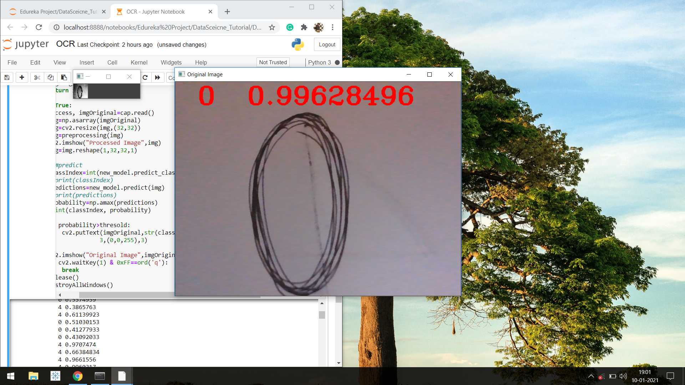
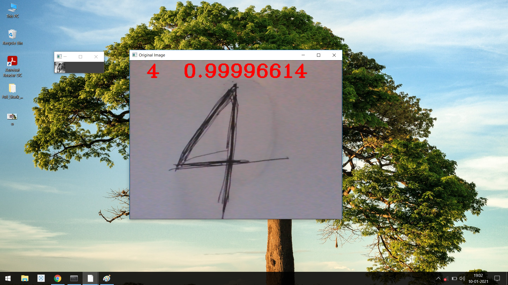
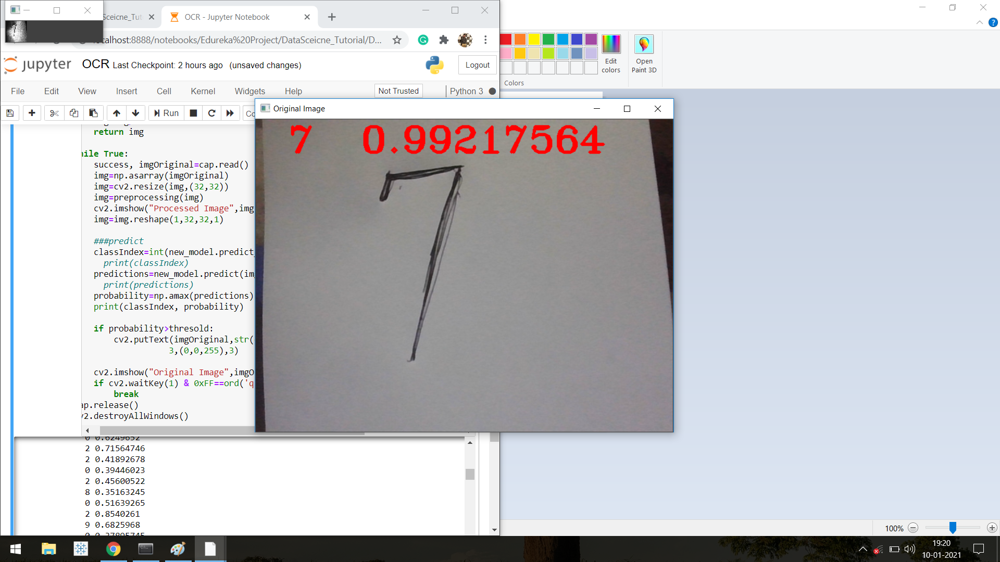
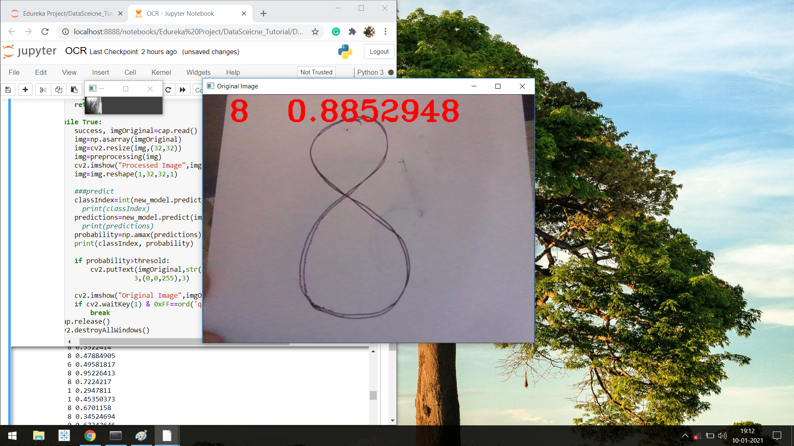

#### In This Project i have created Convolution Neural Netowork to Classify digits from 0 to 9 with 10000 images of 10 different classes and later create a testing script to use along with a webcam.

### outputs:- 
      
    
